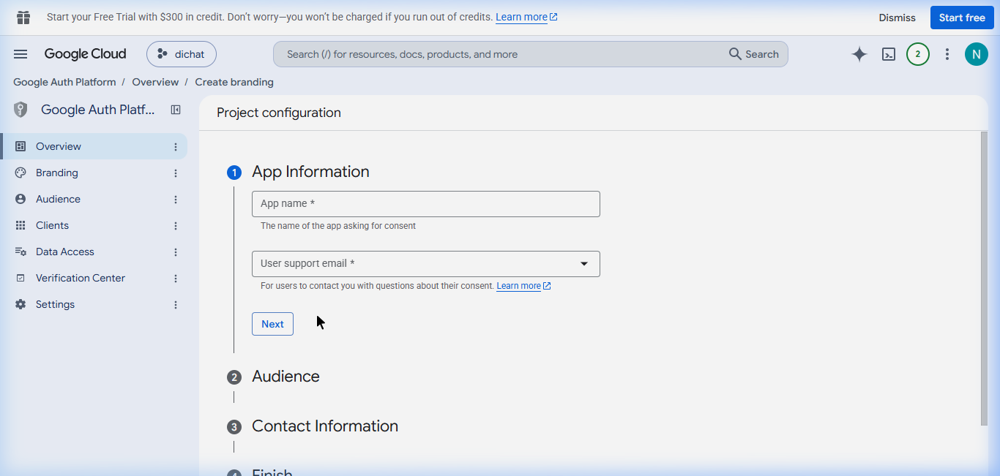
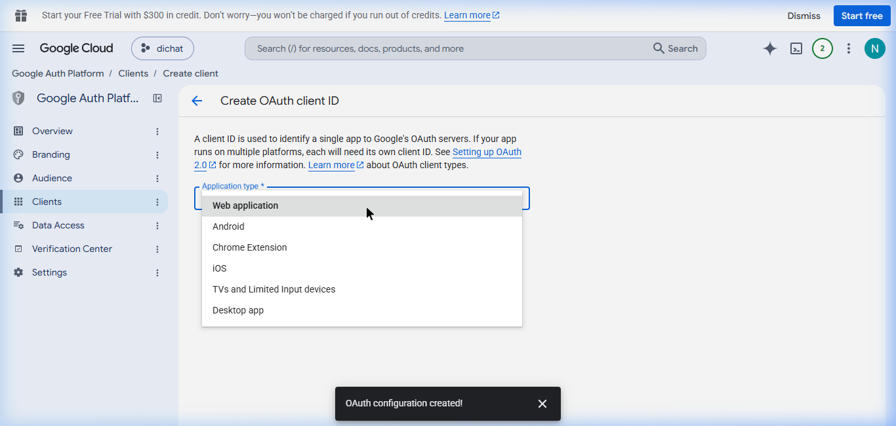

# 📦 Tutorial: Mendapatkan OAuth2 Refresh Token (Google Drive)

Karena Service Account tidak memiliki kuota penyimpanan (0 bytes) untuk pengguna gratis, kita harus menggunakan metode **OAuth2**. Dengan metode ini, bot akan meminjam identitas Gmail Anda (yang memiliki kuota 15GB atau lebih) untuk melakukan *upload* file ke Google Drive.

## Langkah 1: Buat OAuth Consent Screen (Branding)
*(Catatan: Tampilan Google Cloud sering berubah. Saat ini Google menggunakan antarmuka baru bernama "Google Auth Platform" yang membagi pengisian form menjadi beberapa tahap).*

1. Buka [Google Cloud Console](https://console.cloud.google.com/).
2. Pastikan Anda berada di project Anda melalui menu *dropdown* di bagian atas.
3. Cara tercepat menuju halamannya adalah dengan mengklik tautan jalan pintas ini: **[Buka Halaman OAuth Consent Screen](https://console.cloud.google.com/apis/credentials/consent)**. (Atau cari di menu: **APIs & Services** > **OAuth consent screen**).
4. Klik tombol **Get Started** atau **Create** untuk mulai membuat *Branding*.
5. **Tahap 1: App Information**
   Isi `App name` (misal: `Reminder Bot Backup`) dan pilih email Anda di kolom `User support email`. Lalu klik **Next**.
   <br>
6. **Tahap 2: Audience**
   Pilih tipe user **External** (agar bot bisa dipakai dari luar) lalu klik **Next**.
   <br>
7. **Tahap 3: Contact Information**
   Isi email Anda di kolom `Developer contact information`. Centang persetujuan jika ada, lalu klik **Create**.
   <br>

## Langkah 2: Buat OAuth Client ID
1. Pindah ke menu **APIs & Services** > **Credentials** (atau ke menu **Clients** di sidebar kiri).
2. Klik tombol **+ CREATE CREDENTIALS** (atau **Create Client**) di bagian atas, lalu pilih **OAuth client ID**.
   <br>
3. Di kolom **Application type**, klik dan pilih **Web application**.
   <br>
4. Beri nama (bebas), misal: `Web Client 1`.
5. Scroll ke bawah ke bagian **Authorized redirect URIs**.
6. Klik **+ ADD URI** lalu ketik persis seperti ini: `http://localhost:3000/oauth2callback`
7. Klik tombol **CREATE**.

## Langkah 3: Unduh File JSON Kunci
1. Setelah berhasil dibuat, akan muncul jendela *popup* berisi Client ID dan Client Secret Anda.
   <br>
2. Klik tombol **DOWNLOAD JSON** di bagian paling bawah *popup* tersebut.
3. Ubah nama file yang baru didownload tersebut menjadi **`oauth_credentials.json`**.
4. Pindahkan file `oauth_credentials.json` ini ke dalam **folder proyek bot Anda** (bersamaan dengan letak `index.js`).

## Langkah 4: Jalankan Script Pembangkit Token
Sekarang buka terminal/CMD Anda, pastikan Anda berada di folder proyek bot, lalu ketik:
```bash
node get-token.js
```
1. Script akan memberikan sebuah **URL panjang**. Klik URL tersebut (atau *copy-paste* ke browser).
2. Login menggunakan akun Gmail Anda (yang berlangganan 5TB).
3. Jika muncul layar peringatan *"Google hasn't verified this app"*, klik **Advanced (Lanjutan)** > **Go to Reminder Bot Backup (unsafe)**.
4. Klik **Allow/Izinkan** untuk memberikan akses Google Drive.
5. Anda akan dialihkan ke layar putih bertuliskan "✅ Autentikasi Berhasil!".
6. Buka kembali terminal/CMD Anda. Script tadi sudah mencetak sebuah kode panjang yang disebut **Refresh Token**.

## Langkah 5: Simpan ke GitHub Secrets
Sekarang Anda bisa memasukkan kode **Refresh Token** tersebut ke GitHub Secrets Anda dengan nama: `GOOGLE_CREDENTIALS` (menggantikan isi JSON Service Account yang dulu).

Jika sudah siap, beritahu saya agar saya bisa segera mengubah kode `auto-backup.js` untuk menggunakan skema OAuth2 ini!
