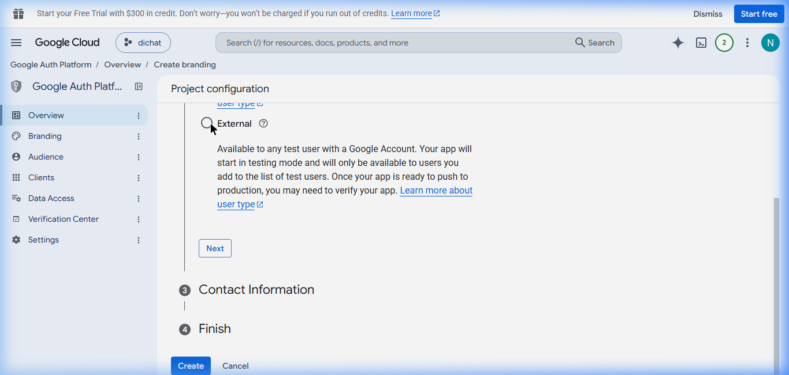
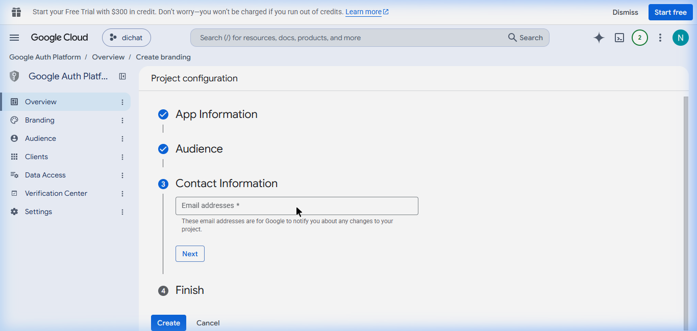
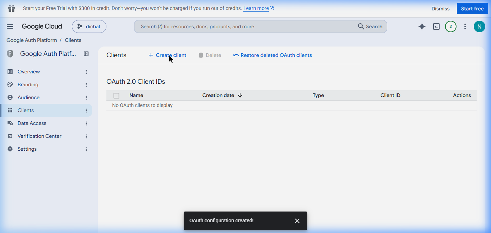
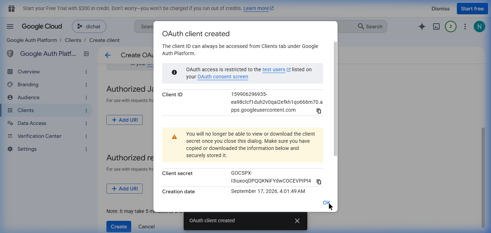

# 📦 Tutorial: Mendapatkan OAuth2 Refresh Token (Google Drive)

Karena Service Account tidak memiliki kuota penyimpanan (0 bytes) untuk pengguna gratis, kita harus menggunakan metode **OAuth2**. Dengan metode ini, bot akan meminjam identitas Gmail Anda (yang memiliki kuota 15GB atau lebih) untuk melakukan *upload* file ke Google Drive.

## Langkah 1: Aktifkan API & Buat OAuth Consent Screen
1. Buka [Google Cloud Console](https://console.cloud.google.com/).
2. Pastikan Anda berada di project yang sama dengan sebelumnya (misal: `reminder-bot`).
3. Cara tercepat menuju halamannya adalah dengan mengklik tautan jalan pintas ini: **[Buka Halaman OAuth Consent Screen](https://console.cloud.google.com/apis/credentials/consent)**. 
4. Pilih tipe user **External** lalu klik **Create**.
<br>
5. Isi formulir yang wajib saja (seperti yang terlihat pada gambar di bawah):
   - **App name**: `Reminder Bot Backup`
   - **User support email**: (Pilih email Anda)
   - **Developer contact information**: (Ketik email Anda lagi)
   - Klik **Save and Continue** sampai selesai (lewati bagian *scopes/test users*).
<br>

## Langkah 2: Buat OAuth Client ID
1. Pindah ke menu **APIs & Services** > **Credentials**.
2. Klik tombol **+ CREATE CREDENTIALS** di bagian atas, lalu pilih **OAuth client ID**.
<br>
3. Di kolom **Application type**, pilih **Web application**.
4. Beri nama (bebas), misal: `Web Client 1`.
5. Scroll ke bawah ke bagian **Authorized redirect URIs**.
6. Klik **+ ADD URI** lalu ketik persis seperti ini: `http://localhost:3000/oauth2callback`
7. Klik tombol **CREATE**.
<br>

## Langkah 3: Unduh File JSON Kunci
1. Setelah berhasil dibuat, akan muncul jendela *popup* berisi Client ID dan Client Secret Anda.
<br>
2. Klik tombol **DOWNLOAD JSON** di bagian paling bawah *popup* tersebut.
3. Ubah nama file yang baru didownload tersebut menjadi **`oauth_credentials.json`**.
4. Pindahkan file `oauth_credentials.json` ini ke dalam **folder proyek bot Anda** (bersamaan dengan letak `index.js`).

## Langkah 4: Jalankan Script Pembangkit Token
Sekarang buka terminal/CMD Anda, pastikan Anda berada di folder proyek bot, lalu ketik:
```bash
node get-token.js
```
1. Script akan memberikan sebuah **URL panjang**. Klik URL tersebut (atau *copy-paste* ke browser).
2. Login menggunakan akun Gmail Anda (yang berlangganan 5TB).
3. Jika muncul layar peringatan *"Google hasn't verified this app"*, klik **Advanced (Lanjutan)** > **Go to Reminder Bot Backup (unsafe)**.
4. Klik **Allow/Izinkan** untuk memberikan akses Google Drive.
5. Anda akan dialihkan ke layar putih bertuliskan "✅ Autentikasi Berhasil!".
6. Buka kembali terminal/CMD Anda. Script tadi sudah mencetak sebuah kode panjang yang disebut **Refresh Token**.

## Langkah 5: Simpan ke GitHub Secrets
Sekarang Anda bisa memasukkan kode **Refresh Token** tersebut ke GitHub Secrets Anda dengan nama: `GOOGLE_CREDENTIALS` (menggantikan isi JSON Service Account yang dulu).

Jika sudah siap, beritahu saya agar saya bisa segera mengubah kode `auto-backup.js` untuk menggunakan skema OAuth2 ini!
