# 📦 Tutorial: Membuat Service Account di Google Cloud Console

Panduan langkah demi langkah untuk membuat **Service Account** dan mengunduh file kunci (credentials) di Google Cloud Console. Service Account adalah "akun robot" yang memungkinkan aplikasi atau bot Anda mengakses layanan Google (seperti Google Drive, Google Sheets, dll) secara otomatis tanpa perlu login manual.

> **Catatan:** Tutorial ini ditujukan untuk pemula yang belum pernah menggunakan Google Cloud Console.

---

## Prasyarat

- Memiliki akun Google (Gmail).
- Memiliki akses internet dan browser (Chrome / Edge / Firefox).

---

## Langkah 1: Buka Google Cloud Console

Buka browser Anda dan kunjungi alamat berikut:

```
https://console.cloud.google.com/
```

Jika diminta login, masukkan email dan password akun Google Anda.

Setelah berhasil masuk, Anda akan melihat halaman **Dashboard** Google Cloud Console.

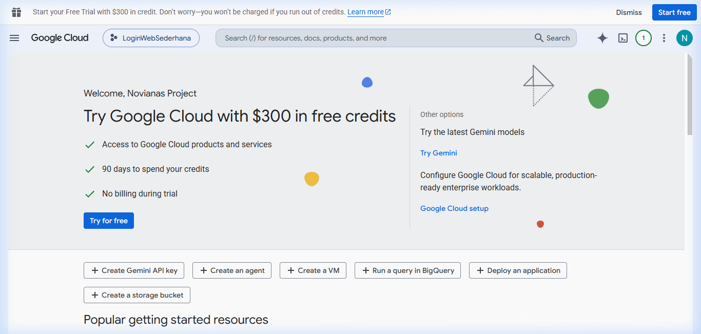

---

## Langkah 2: Pilih atau Buat Project

Di bagian atas halaman, klik nama project yang sedang aktif (di sebelah logo **Google Cloud**). Akan muncul jendela popup **"Select a resource"** yang berisi daftar project Anda.

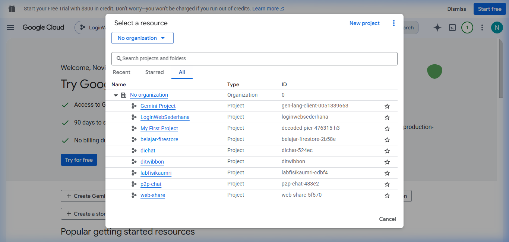

- Jika Anda **sudah memiliki project** yang ingin digunakan, klik project tersebut.
- Jika Anda **belum memiliki project**, klik tombol **"New project"** di pojok kanan atas popup, beri nama (misalnya `reminder-bot`), lalu klik **Create**.

> **Tips:** Anda boleh menggunakan project yang sudah ada, tidak harus membuat project baru.

---

## Langkah 3: Buka Menu "IAM & Admin" → "Service Accounts"

1. Klik ikon **menu hamburger** (☰) di pojok kiri atas.
2. Scroll ke bawah dan cari menu **IAM & Admin**.
3. Klik **Service Accounts**.

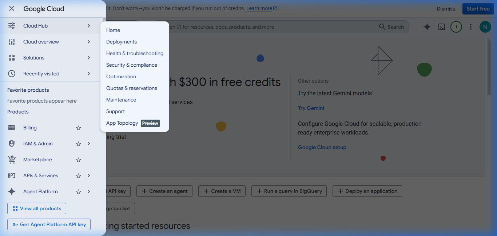

Anda akan dibawa ke halaman **Service Accounts** yang menampilkan daftar akun layanan yang ada.

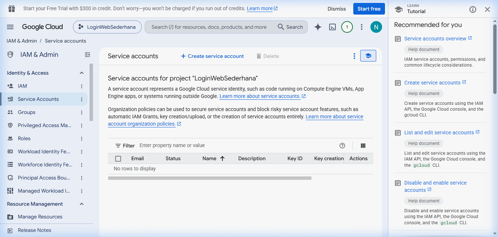

---

## Langkah 4: Buat Service Account Baru

Klik tombol **"+ Create service account"** di bagian atas halaman.

Anda akan melihat formulir **"Create service account"** dengan 3 langkah:

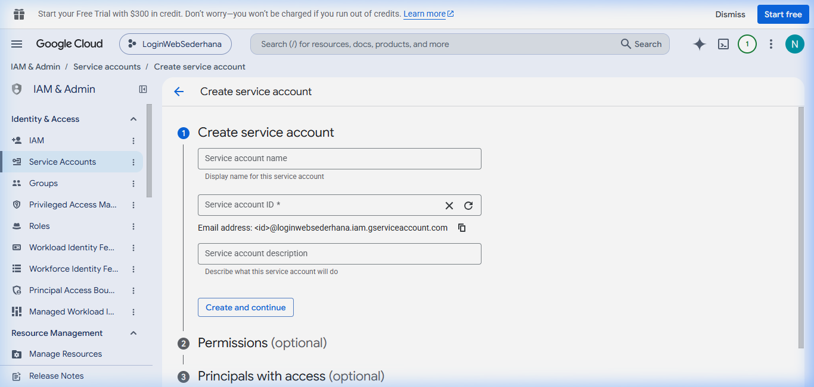

---

### Langkah 4a: Isi Nama Service Account

Pada kolom **"Service account name"**, ketikkan nama yang mudah dikenali, misalnya:

```
backup-bot
```

Kolom **"Service account ID"** dan **"Email address"** akan terisi otomatis.

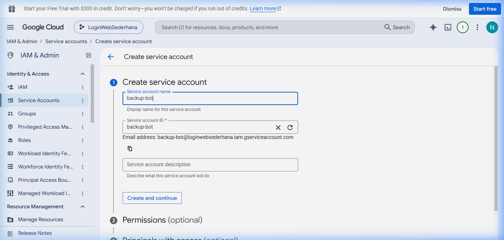

Klik tombol **"Create and continue"**.

---

### Langkah 4b: Grant Access (Opsional — Lewati Saja)

Langkah ini meminta Anda untuk memberikan *role* (peran) tertentu kepada Service Account. Untuk keperluan backup ke Google Drive, **Anda tidak perlu mengisi apapun di sini**.

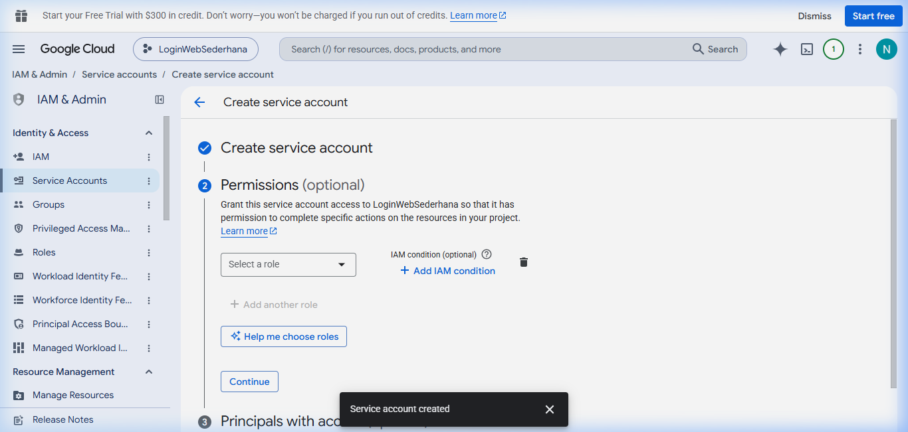

Klik **"Continue"** untuk melanjutkan.

---

### Langkah 4c: Grant Users Access (Opsional — Lewati Saja)

Langkah ini juga opsional. **Lewati saja** dengan langsung mengklik tombol **"Done"**.

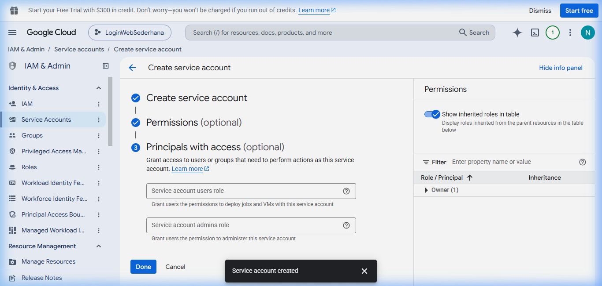

---

## Langkah 5: Verifikasi — Service Account Berhasil Dibuat! ✅

Setelah mengklik **Done**, Anda akan kembali ke halaman daftar **Service Accounts**. Service Account baru Anda (`backup-bot`) seharusnya sudah muncul di tabel.

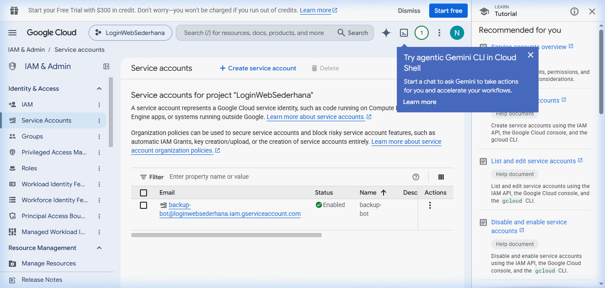

> **Penting:** Catat alamat email Service Account Anda (misalnya: `backup-bot@nama-project.iam.gserviceaccount.com`). Email ini akan digunakan nanti untuk memberikan akses ke folder Google Drive Anda.

---

## Langkah 6: Buka Detail Service Account & Masuk ke Tab "Keys"

1. Klik pada baris Service Account **backup-bot** di tabel untuk membuka halaman detailnya.
2. Di halaman detail, klik tab **"Keys"**.

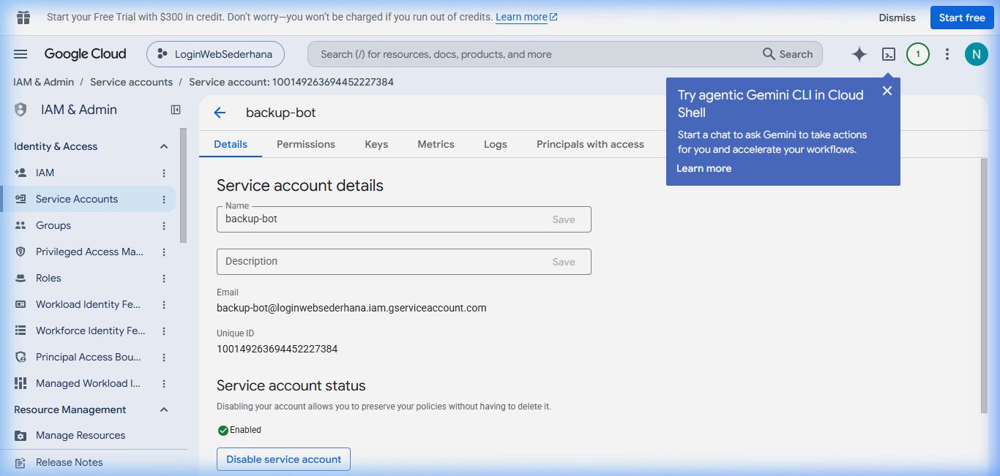

Anda akan melihat halaman **Keys** yang masih kosong (belum ada kunci).

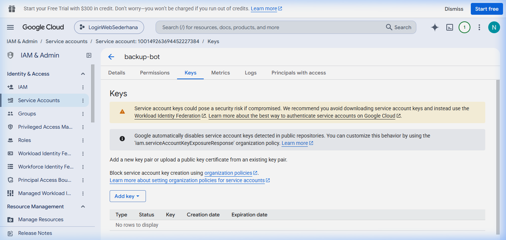

---

## Langkah 7: Buat Kunci Baru (JSON Key)

1. Klik tombol **"Add key"**.
2. Dari menu dropdown yang muncul, pilih **"Create new key"**.

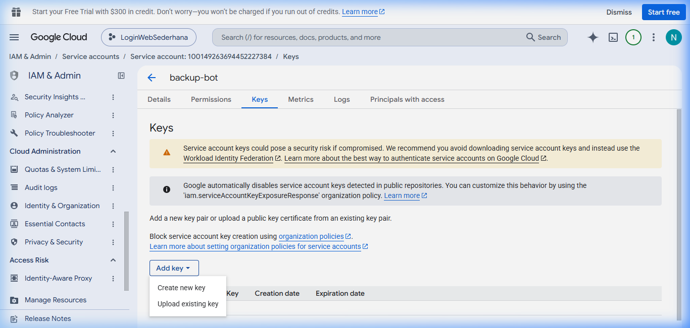

3. Pada dialog yang muncul, pastikan format **"JSON"** sudah terpilih (ini adalah pilihan default dan yang direkomendasikan).
4. Klik tombol **"Create"**.

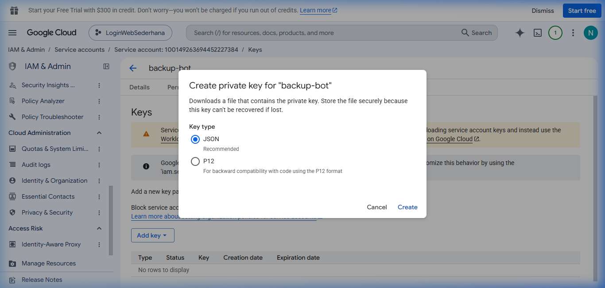

---

## Langkah 8: File Kunci Berhasil Diunduh! ✅

Setelah mengklik **Create**, file kunci JSON akan **otomatis terunduh** ke komputer Anda (biasanya masuk ke folder `Downloads`).

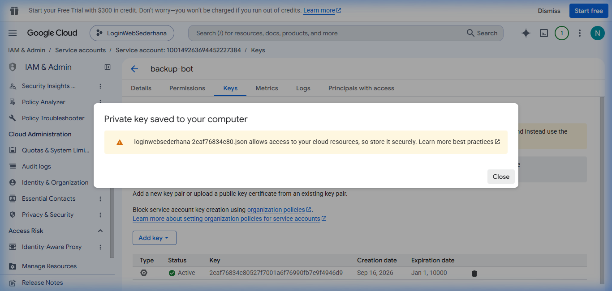

> ⚠️ **PERINGATAN KEAMANAN:**
> - File ini berisi kredensial rahasia. **Jangan pernah membagikan file ini ke siapapun** atau mengunggahnya ke GitHub/repository publik.
> - Simpan file ini di tempat yang aman.
> - Jika file ini hilang, Anda bisa membuat kunci baru, tetapi kunci lama tidak bisa diunduh ulang.


---

## Selesai! 🎉

Anda telah berhasil membuat **Service Account** dan mengunduh file kunci JSON-nya.

### Ringkasan hasil yang Anda dapatkan:

| Item | Keterangan |
|------|------------|
| **Email Service Account** | `backup-bot@nama-project.iam.gserviceaccount.com` |
| **File Kunci JSON** | File `.json` yang terunduh ke folder `Downloads` Anda |

Simpan kedua informasi ini — Anda akan membutuhkannya saat mengonfigurasi aplikasi atau bot yang ingin terhubung ke layanan Google.

---

> ⚠️ **Pengingat Keamanan:**
> - **Jangan pernah** membagikan file kunci JSON ke siapapun atau mengunggahnya ke GitHub / repository publik.
> - Jika file kunci hilang atau bocor, segera hapus kunci tersebut di tab **Keys** dan buat kunci baru.
